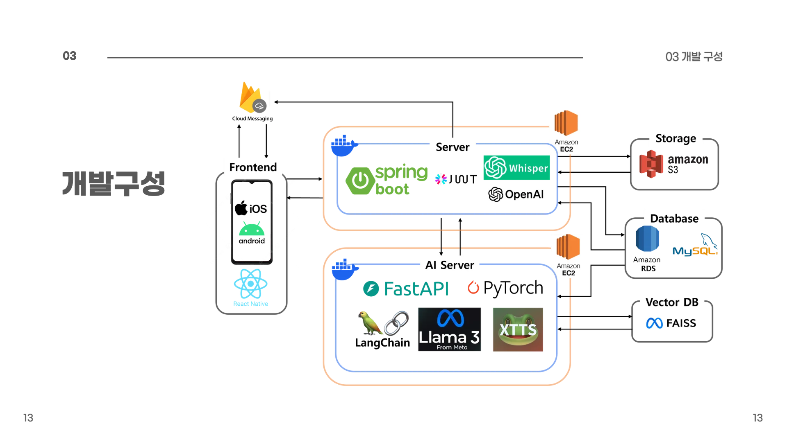
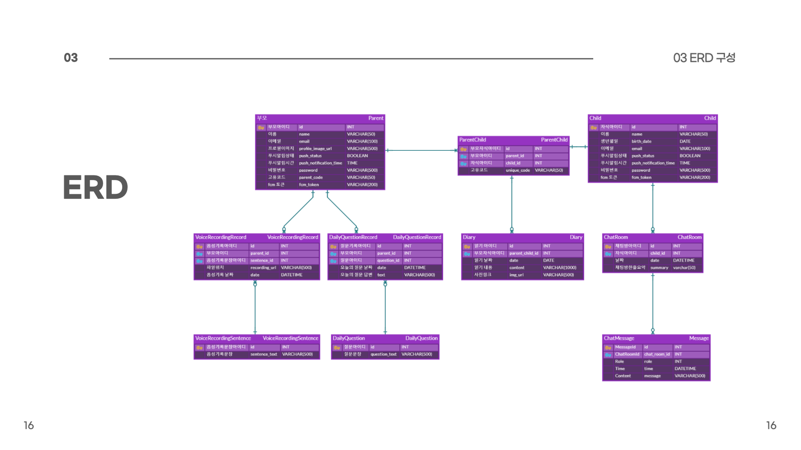

# CLONING BACKEND
'

# 😀 백엔드 팀원 및 역할

| 이름   | 역할      | 담당   |
| ------ | --------- | ----- |
| 소원 | Back-end / AI | <details><summary>채팅, 배지, 오늘의질문, RAG, DB, 배포/인프라, ERD</summary><b>🗨️ 실시간 채팅 시스템</b><ul><li>채팅방 생성, 메시지 전송 및 답변 생성 API</li><li>메시지 히스토리 조회 / 채팅방 목록 조회 API</li><li>Spring Boot ↔ FastAPI 간 텍스트 → 음성 합성 연동</li><li>Whisper 기반 음성 → 텍스트(STT) 변환 API</li><li>초기 메시지 기반 채팅방 생성 및 메시지 소속 관리 로직 설계</li></ul><b>🗂️ 기록 현황 / 배지 시스템</b><ul><li>주간 기준 배지 획득 여부 조회</li><li>달력 기반 활동 현황 조회 API</li><li>일기/질문/기록 여부에 따른 UI 표시 데이터 제공</li><li>누적 기록 기반 진행률 계산 로직 구현</li></ul><b>📝 오늘의 질문(Daily Question)</b><ul><li>질문 리스트 조회(아코디언용 전체 텍스트 포함)</li><li>답변 작성/수정/조회 API</li><li>날짜별 답변 유무 기반 분기 처리 로직</li><li>페이징 구조 설계 반영</li><li>자정 기준 자동 질문 로테이션 로직 구현</li></ul><b>🧠 RAG 파이프라인 구축</b><ul><li>LangChain 기반 RAG 구조 설계 및 구현</li><li>텍스트 청크 분할 후 임베딩 생성</li><li>Cosine Similarity 기반 문맥 검색</li><li>검색된 컨텍스트를 활용한 정확한 답변 생성</li></ul><b>🗂️ 데이터베이스 인프라 구성</b><ul><li>ChromaDB 기반 벡터 저장소 초기 구축 및 임베딩 관리 파이프라인 설계</li><li>AWS RDS(MySQL) 기반 서비스 데이터 저장 환경 구성</li></ul><b>☁️ 배포 및 서버 인프라</b><ul><li>Docker 기반 AWS EC2 컨테이너 빌드 & 배포</li><li>RDS–Spring Boot–FastAPI 연동</li><li>CUDA + NVIDIA Docker 기반 GPU 추론 환경 구축</li></ul><b>🧱 ERD 및 도메인 모델링</b><ul><li>전체 서비스 ERD 설계</li><li>도메인 구조화(Child, ChatRoom, Message 등)</li></ul></details>|
| 조소윤 | Back-end / AI | <details><summary>인증/보안, 음성기록, 육아일기, 푸시알림, 부모/자녀 마이페이지, TTS, 배포/인프라, DB, ERD</summary><b>🔐 인증/보안</b><ul><li>부모와 자녀 회원가입 로직 구현</li><li>이메일 중복 검사 API</li><li>Spring Security 기반 JWT 인증/인가 구조 구축</li><li>Access Token 발급 로직 구현</li><li>로그아웃 API</li><li>회원 탈퇴 API</li></ul><b>🎙️ 음성 기록 기능</b><ul><li>TTS 모델 학습용 음성 녹음 업로드 처리</li><li>음성 파일 생성·병합·저장 로직</li><li>음성 기록 진행 현황 API</li></ul><b>📷 육아일기(사진 포함) API</b><ul><li>부모 공통 일기 작성 및 자녀별 개별 일기 작성 API</li><li>일기 작성 전 기존 작성 여부 확인 API</li><li>육아일기 수정/작성/날짜별 기록 조회/캘린더 API 구현</li></ul><b>📱 푸시 알림</b><ul><li>Firebase Cloud Messaging(FCM) 사용</li><li>Spring Boot 스케줄러 기반 지정 시간 푸시 알림</li></ul><b>👨‍👧 부모 마이페이지</b><ul><li>부모 정보 조회 및 수정(이름, 프로필 사진)</li><li>자녀 목록 조회 및 관리(추가, 이름 변경)</li><li>알림 시간 설정(on/off 포함)</li><li>육아일기 캘린더 조회 및 날짜별 일기 확인</li></ul><b>🔊 텍스트 음성 변환(TTS) 기능</b><ul><li>XTTS 모델 하이퍼파라미터 파인튜닝</li><li>XTTS 기반 음성 재생 기능 API</li></ul><b>🧒 자녀 마이페이지</b><ul><li>자녀 정보 조회</li><li>사진첩 조회</li><li>알림 시간 설정(on/off 포함)</li></ul><b>☁️ 배포 및 인프라</b><ul><li>Docker 기반 AWS EC2 컨테이너 빌드 & 배포</li><li>CUDA + NVIDIA Docker 기반 GPU 추론 환경 구축</li><li>S3와 Spring Boot 연동</li></ul><b>🗂️ 데이터베이스 인프라 구성</b><ul><li>FAISS 기반 벡터 저장소 초기 구축 및 임베딩 파이프라인 설계</li></ul><b>🧱 ERD 및 도메인 모델링</b><ul><li>전체 서비스 ERD 설계</li><li>도메인 구조화(DailyQuestion, DailyQuestionRecord, Parent, VoiceRecordingRecord, VoiceRecordingSentence)</li></ul></details> |
| 홍다인 | Back-end  / AI  |<details><summary>음성처리, 육아일기, 사진첩, LLM 전처리, LLM 파인튜닝, 배포/인프라, ERD</summary><b>🔊 부모 음성 처리 기능</b><ul><li>부모 음성 녹음 업로드 처리</li><li>음성 파일 생성·병합·저장 로직</li><li>음성 기록 조회/관리 API</li></ul><b>📷 육아일기(사진 포함) API</b><ul><li>텍스트 + 이미지 업로드/조회 API</li><li>AWS S3 기반 이미지 저장소 구축</li><li>캘린더 기반 전체 육아일기 조회</li><li>날짜별 육아일기 상세 조회</li><li>육아일기 작성 기능</li><li>작성된 일기 수정 기능</li></ul><b>📷 사진첩 기능</b><ul><li>사진 업로드 API</li><li>사진 저장 및 관리 로직</li><li>업로드된 이미지 조회 기능</li><li>S3 기반 사진 파일 저장 구조 적용</li></ul><b>🧠 LLM 데이터 수집·전처리</b><ul><li>AI Hub 공감형 대화 데이터에서 부모–자녀 대화만 선별</li><li>발화 역할 통일(‘어머니/아버지 → 부모’) 및 문장 정제·구조화</li><li>LLM 학습용 Instruction 형식 데이터셋 구성</li></ul><b>🤖 LLM 파인튜닝</b><ul><li>Llama 3 Korean Blossom 8B로 부모 말투·대화 패턴 학습</li><li>전처리된 대화 데이터를 활용해 공감형 응답 생성 모델 구축</li><li>FastAPI 환경에서 학습 모델 로딩하여 실시간 대화 서비스 적용</li></ul><b>☁️ 배포 및 인프라</b><ul><li>Docker 기반 컨테이너화</li><li>Docker 기반 AWS EC2 컨테이너 빌드 & 배포</li><li>EC2에서 Spring Boot · FastAPI 서버 연동</li></ul><b>🧱 ERD 및 도메인 모델링</b><ul><li>전체 서비스 ERD 설계</li><li>도메인 구조화(ParentChild, Diary 등)</li></ul></details> |
<br>

# 💡 주요 기능

## 육아일기 기록: 자녀별로 업로드한 육아일기를 통해, RAG + LLM 모델이 부모의 사고방식 학습

<h3>자녀를 선택해 날짜별로 사진을 첨부할 수 있는 육아일기를 작성할 수 있습니다. </h3>
<h3>업로드한 육아일기를 통해 부모의 사고방식을 학습할 수 있습니다. </h3>

<hr>
<br>

## 음성 녹음 기록: 부모가 기록한 음성 녹음 기록을 통해 XTTS 모델을 활용하여 사용자 맞춤 TTS(Text-to-Speech) 모델 생성

<h3>부모는 자신의 음성을 녹음하고 저장할 수 있습니다.  </h3>
<h3>추후 이를 바탕으로 유사한 톤과 억양을 가지는 Text-to-Speech(TTS) 모델을 구현합니다.  </h3>
<h3>이를 통해 자녀는 채팅 메시지를 부모님의 음성에 가까운 형태로 들을 수 있습니다. </h3>
<hr>
<br>

## 오늘의 질문 기록: 일기와 더불어, 오늘의 질문에 대한 답변을 자녀를 위한 전용 RAG + LLM 모델 생성에 활용

<h3>매일 달라지는 질문에 대한 답변을 기록해 자녀와 관련된 데이터를 남길 수 있습니다. </h3>
<hr>
<br>

## 자녀 채팅: 부모의 사고를 학습한 RAG + LLM 모델이 부모를 대신해 자녀의 질문에 답변, 또한 텍스트를 부모의 목소리로 재생 가능

<h3>부모의 사고를 학습시켜 생성한 AI가 부모를 대신해 자식과 채팅할 수 있습니다.  </h3>
<h3>부모가 녹음한 음성과 유사한 톤과 억양으로 텍스트를 들을 수 있습니다.  </h3>

# 📂 프로젝트 구성




## 디렉토리 구조
```markdown
src/main/java/passion/togedu
├── TogeduApplication.java
│
├── config
│     ├── CorsConfig.java
│     ├── FCMConfig.java
│     ├── OpenAIConfig.java
│     ├── S3Config.java
│     └── SecurityConfig.java
│
├── controller
│     ├── ChatMessageController.java
│     ├── ChatRoomController.java
│     ├── DailyQuestionController.java
│     ├── DiaryController.java
│     ├── GalleryController.java
│     ├── MainController.java
│     ├── MypageController.java
│     ├── SignController.java
│     ├── StatController.java
│     ├── TestController.java
│     └── VoiceRecordingController.java
│
├── domain
│     ├── ChatMessage.java
│     ├── ChatRoom.java
│     ├── DailyQuestion.java
│     ├── DiaryRecord.java
│     ├── DiarySentence.java
│     ├── FCMNotification.java
│     ├── GalleryPhoto.java
│     ├── MainStat.java
│     ├── Parent.java
│     ├── Child.java
│     ├── Stat.java
│     ├── Token.java
│     ├── VoiceRecordingRecord.java
│     └── VoiceRecordingSentence.java
│
├── dto
│     ├── DailyQuestion/
│     ├── chat/
│     ├── diary/
│     ├── fcm/
│     ├── gallery/
│     ├── main/
│     ├── mypage/
│     ├── sign/
│     ├── stat/
│     └── voiceRecording/
│
├── jwt
│     ├── JwtAccessDeniedHandler.java
│     ├── JwtAuthenticationEntryPoint.java
│     ├── JwtFilter.java
│     ├── JwtSecurityConfig.java
│     ├── SecurityUtil.java
│     └── TokenProvider.java
│
├── repository
│     ├── ChatMessageRepository.java
│     ├── ChatRoomRepository.java
│     ├── ChildRepository.java
│     ├── DailyQuestionRepository.java
│     ├── DiaryRecordRepository.java
│     ├── DiarySentenceRepository.java
│     ├── GalleryPhotoRepository.java
│     ├── ParentRepository.java
│     ├── StatRepository.java
│     ├── VoiceRecordingRecordRepository.java
│     └── VoiceRecordingSentenceRepository.java
│
└── service
      ├── ChatMessageService.java
      ├── ChatRoomService.java
      ├── DailyQuestionService.java
      ├── DiaryService.java
      ├── GalleryService.java
      ├── MainService.java
      ├── MypageService.java
      ├── SignService.java
      ├── StatService.java
      ├── VoiceRecordingService.java
      └── WhisperService.java


```
