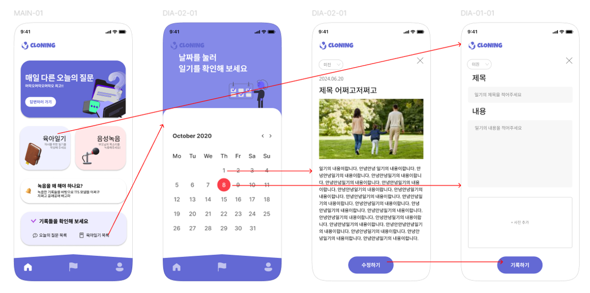
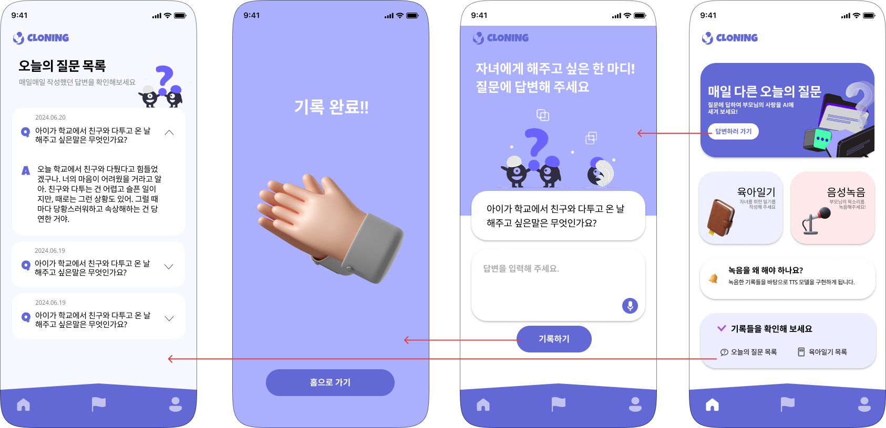
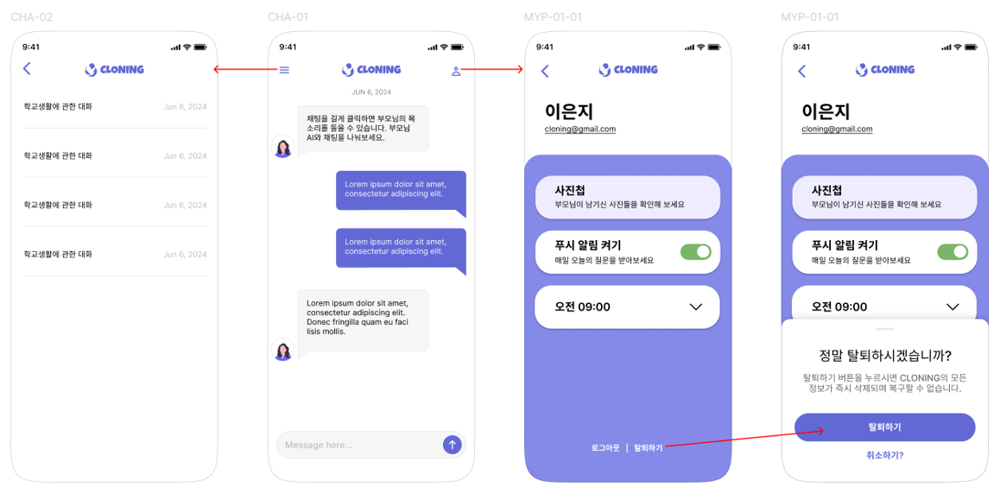

# CLONING BACKEND


# 😀 백엔드 팀원 및 역할

| 이름   | 역할      |
| ------ | --------- |
| 소원 | Back-end  |
| 조소윤   | Back-end  |
| 홍다인 | Back-end  |
<br>

# 💡 주요 기능

## 육아일기 기록: 자녀별로 업로드한 육아일기를 통해, RAG + LLM 모델이 부모의 사고방식 학습

<h3>자녀를 선택해 날짜별로 사진을 첨부할 수 있는 육아일기를 작성할 수 있습니다. </h3>
<h3>업로드한 육아일기를 통해 부모의 사고방식을 학습할 수 있습니다. </h3>

<hr>
<br>

## 음성 녹음 기록: 부모가 기록한 음성 녹음 기록을 통해 XTTS 모델을 활용하여 사용자 맞춤 TTS(Text-to-Speech) 모델 생성

<h3>부모는 자신의 음성을 녹음하고 저장할 수 있습니다.  </h3>
<h3>추후 이를 바탕으로 유사한 톤과 억양을 가지는 Text-to-Speech(TTS) 모델을 구현합니다.  </h3>
<h3>이를 통해 자녀는 채팅 메시지를 부모님의 음성에 가까운 형태로 들을 수 있습니다. </h3>
<hr>
<br>
## 오늘의 질문 기록: 일기와 더불어, 오늘의 질문에 대한 답변을 자녀를 위한 전용 RAG + LLM 모델 생성에 활용

<h3>매일 달라지는 질문에 대한 답변을 기록해 자녀와 관련된 데이터를 남길 수 있습니다. </h3>
<hr>
<br>
## 자녀 채팅: 부모의 사고를 학습한 RAG + LLM 모델이 부모를 대신해 자녀의 질문에 답변, 또한 텍스트를 부모의 목소리로 재생 가능

<h3>부모의 사고를 학습시켜 생성한 AI가 부모를 대신해 자식과 채팅할 수 있습니다.  </h3>
<h3>부모가 녹음한 음성과 유사한 톤과 억양으로 텍스트를 들을 수 있습니다.  </h3>

# 📂 프로젝트 구성도 및 디렉토리 구조

아키텍쳐(Architecture)

```markdown
src/main/java/passion/togedu
├── TogeduApplication.java
│
├── config
│     ├── CorsConfig.java
│     ├── FCMConfig.java
│     ├── OpenAIConfig.java
│     ├── S3Config.java
│     └── SecurityConfig.java
│
├── controller
│     ├── ChatMessageController.java
│     ├── ChatRoomController.java
│     ├── DailyQuestionController.java
│     ├── DiaryController.java
│     ├── GalleryController.java
│     ├── MainController.java
│     ├── MypageController.java
│     ├── SignController.java
│     ├── StatController.java
│     ├── TestController.java
│     └── VoiceRecordingController.java
│
├── domain
│     ├── ChatMessage.java
│     ├── ChatRoom.java
│     ├── DailyQuestion.java
│     ├── DiaryRecord.java
│     ├── DiarySentence.java
│     ├── FCMNotification.java
│     ├── GalleryPhoto.java
│     ├── MainStat.java
│     ├── Parent.java
│     ├── Child.java
│     ├── Stat.java
│     ├── Token.java
│     ├── VoiceRecordingRecord.java
│     └── VoiceRecordingSentence.java
│
├── dto
│     ├── DailyQuestion/
│     ├── chat/
│     ├── diary/
│     ├── fcm/
│     ├── gallery/
│     ├── main/
│     ├── mypage/
│     ├── sign/
│     ├── stat/
│     └── voiceRecording/
│
├── jwt
│     ├── JwtAccessDeniedHandler.java
│     ├── JwtAuthenticationEntryPoint.java
│     ├── JwtFilter.java
│     ├── JwtSecurityConfig.java
│     ├── SecurityUtil.java
│     └── TokenProvider.java
│
├── repository
│     ├── ChatMessageRepository.java
│     ├── ChatRoomRepository.java
│     ├── ChildRepository.java
│     ├── DailyQuestionRepository.java
│     ├── DiaryRecordRepository.java
│     ├── DiarySentenceRepository.java
│     ├── GalleryPhotoRepository.java
│     ├── ParentRepository.java
│     ├── StatRepository.java
│     ├── VoiceRecordingRecordRepository.java
│     └── VoiceRecordingSentenceRepository.java
│
└── service
      ├── ChatMessageService.java
      ├── ChatRoomService.java
      ├── DailyQuestionService.java
      ├── DiaryService.java
      ├── GalleryService.java
      ├── MainService.java
      ├── MypageService.java
      ├── SignService.java
      ├── StatService.java
      ├── VoiceRecordingService.java
      └── WhisperService.java


```
